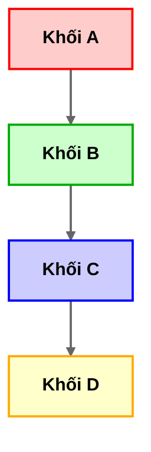
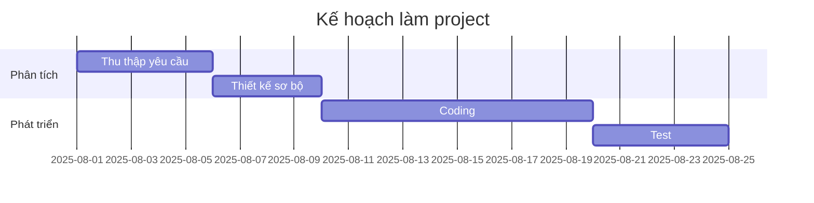

# AiForDev-Mermaid

```mermaid
graph TD
  A[Khối A] --> B[Khối B]
  B[Khối B] --> C[Khối C]
  C[Khối C] --> D[Khối D]

  style A fill:#ffcccc,stroke:#ff0000,stroke-width:2px,color:#000,font-weight:bold
  style B fill:#ccffcc,stroke:#00aa00,stroke-width:2px,color:#000,font-weight:bold
  style C fill:#ccccff,stroke:#0000ff,stroke-width:2px,color:#000,font-weight:bold
  style D fill:#ffffcc,stroke:#ffaa00,stroke-width:2px,color:#000,font-weight:bold

  linkStyle default stroke:#666,stroke-width:2px

```

```mermaid
gantt
  title Kế hoạch làm project
  dateFormat  YYYY-MM-DD
  section Phân tích
  Thu thập yêu cầu   :a1, 2025-08-01, 5d
  Thiết kế sơ bộ     :a2, after a1, 4d
  section Phát triển
  Coding             :b1, 2025-08-10, 10d
  Test               :b2, after b1, 5d

```
